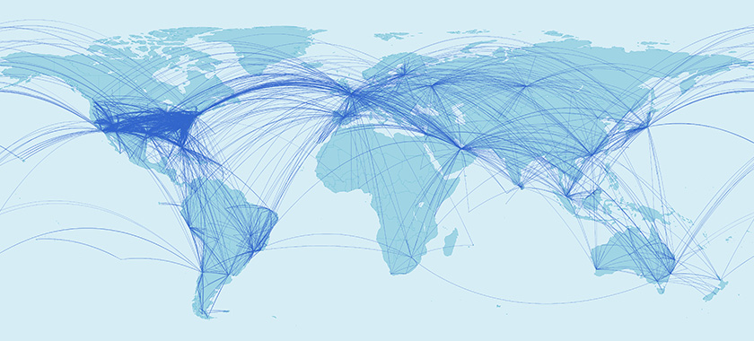
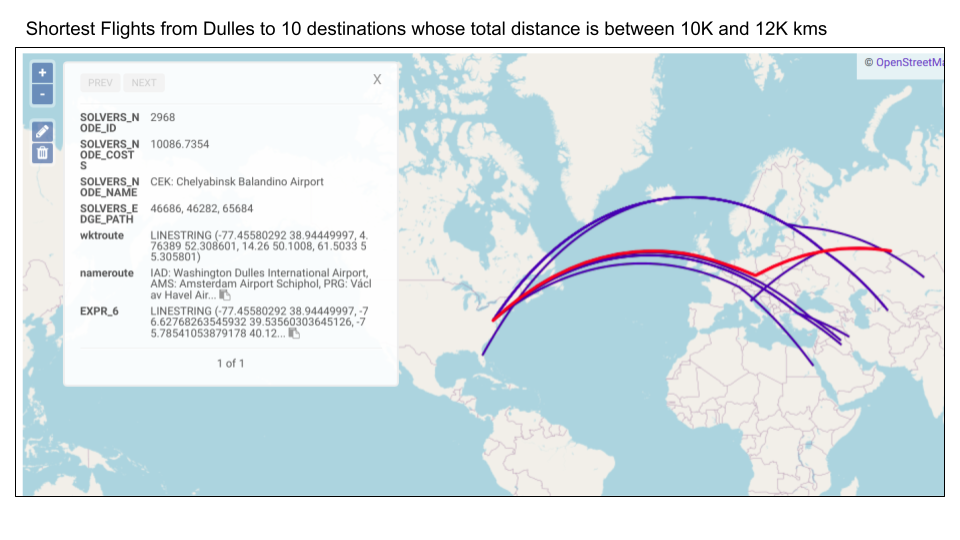
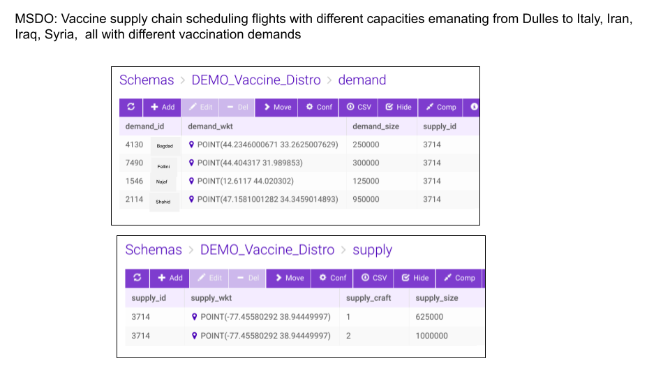
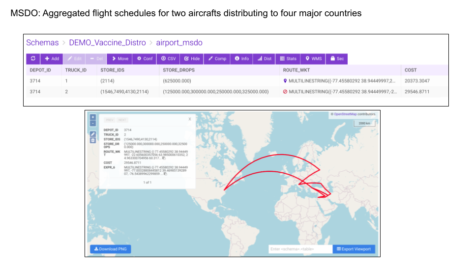
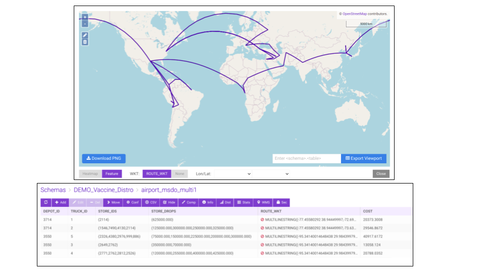

# Efficiently Donating Excess COVID Vaccine Supplies
###   Exploring logistics optimizations in the context of COVID vaccination donations
by Kaan Karamete, Saif Ahmed, Matt Brown, Kyle Sutton, and Chad Meley



## About The Project
We've all heard of the Traveling Salesperson Problem, it is one of the most common Graph problems and has numerous implementations. In the practice, however, problems are much more complicated. In the world of logistics, a more realistic setup is typically the Multiple Supply Demand Chain Optimization (MSDO), where there are multiple sources and sinks and we're looking for the most optimal delivery routes. A generic overview can be seen here: [https://www.kinetica.com/blog/kinetica-graph-analytics-multiple-supply-demand-chain-optimization-msdo-graph-solver/](https://www.kinetica.com/blog/kinetica-graph-analytics-multiple-supply-demand-chain-optimization-msdo-graph-solver/).

To demonstrate Multiple Supply Demand Chain Optimization (MSDO) with an immediate challenge we face globally, we've modeled the challenge of vaccine donations. The US has excess vaccine supply which expires over time. If supply is expiring, it is better to donate it abroad before expiration, as quickly as possible. The White House has been doing this. But can it be done more efficiently?

This is a complex problem:

* We have multiple supply sites (each state or region) which can feed into major international airports
* We have multiple demand sites (many nations), many of which desperately require more vaccine supply
* We have time constraints since accumulation, transport, and distribution need to be faster than expiration timelines
* Everything above is dynamic -- the supply and demand constantly changes with broad usage and infection trends

We have a Multiple Supply Demand Chain Optimization (MSDO) problem! We've modeled the supply, demand, routes, and have everything ready to run on a database (to respond to daily changes in global supply and demand.) The setup documentation can be seen at https://docs.kinetica.com/7.1/guides/match_graph_dc_multi_supply_demand/ but it will be more instructive to run it yourself below. Everything below will run on the Developer Edition (https://www.kinetica.com/try/) or on Kinetica Cloud (https://www.kinetica.com/kinetica-as-a-service-on-azure/)

## Getting Started

Import from GitHub:

```
	git clone git@github.com:kineticadb/community-vaccines.git
	cd community-vaccines
```

Set up python dependencies:

```
	pip install -r requirements.txt
```
Set up [Kinetica Developer Edition](https://www.kinetica.com/try/) or [Kinetica Cloud](https://www.kinetica.com/kinetica-as-a-service-on-azure/) and export your credentials as environment variables. 
The Jupyter notebook will lead you from start to finish!

```	
	jupyter notebook
```

# Results

## Quick Test Run: Single Source --> Multiple Destinations

You can see some results below, but we encourge you to _run this yourself_ and tune the optimization per your liking. The best way is to run the [Jupyter Notebook https://github.com/kineticadb/community-vaccines/blob/master/start-here.ipynb](https://github.com/kineticadb/community-vaccines/blob/master/start-here.ipynb)


Finally, we plot out the full route we would use for the round-trip:
    



## Incremental Improvement: Two Sources --> Multiple Destinations

This is good, but lets continue to refine this. We can add a second departure hub in the US to route vaccine supply from the south, lets set up both IAD (Washington Dulles Airport) and DFW (Dallas Forth Worth Airport.) There are a lot of possibilities here, and you can _customize this any way you wish_ -- the best way is to run the [Jupyter Notebook https://github.com/kineticadb/community-vaccines/blob/master/start-here.ipynb](https://github.com/kineticadb/community-vaccines/blob/master/start-here.ipynb)



## Taking This Further

Real life is complex. To make predictions or decisions, we create models to represent reality the best we can balancing trade-offs between correctness with complexity. So far, we've made a number of simplifying assumptions, but we can continue to refine the model to introduce more features and address nuances. Some reasonable next steps would be:

* Come up with a more advanced supply model using CDC data but with more nuance around vaccine expirations, expected usage before expiration, etc.
* Come up with a more advanced demand model using OWID data, but with your thoughts on prioriization schems -- do we prioritize the elderly population (more at risk), or prioritize the young (more likely to be outside and spread disease), or prioritize countries with the most deaths, or prioritize the countries with the least access to vaccination?
* Add several more regional US centers, perhps one for the midwest (Chicago ORD) and one for the west (San Francisco SFO)
* Consider that multi-hop drop-offs themselves require time, and thus, consider how many days to expiration are required on vaccines beyond which we should avoid transporting them

## Contact Us
- info@kinetica.com
- https://www.kinetica.com/contact/
- Authors
	- Kaan Karamete
	- Saif Ahmed
	- Matt Brown
	- Kyle Sutton
	- Chad Meley

## Data Sources
* Vaccine Distribution by the [CDC](https://covid.cdc.gov/covid-data-tracker/#vaccinations_vacc-total-admin-rate-total)
* Global COVID Statistics from [Our World in Data](https://ourworldindata.org/coronavirus)

## References
1. [Travelling Salesperson Problem](https://en.wikipedia.org/wiki/Travelling_salesman_problem)
2. [White House Fact Sheet: President Biden Announces Major Milestone in Administration’s Global Vaccination Efforts: More Than 100 Million U.S. COVID-⁠19 Vaccine Doses Donated and Shipped Abroad](https://www.whitehouse.gov/briefing-room/statements-releases/2021/08/03/fact-sheet-president-biden-announces-major-milestone-in-administrations-global-vaccination-efforts-more-than-100-million-u-s-covid-19-vaccine-doses-donated-and-shipped-abroad/)